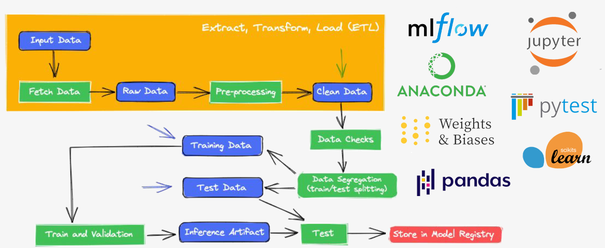
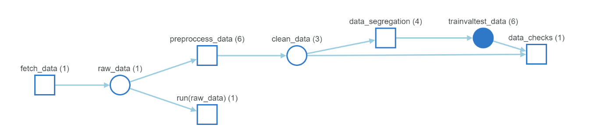

# Airbnb House Price Prediction: getting started with MLOps




> Implementing a complete MLOps pipeline to deploy an AirBnb House Price Prediction (AHPP) model in production. If you are a portuguese speaker, try to watch my 5 minutes [explanation video](https://bit.ly/3OWtTy4) about this project!

### Adjustments and improvements

This project is still under development and the next steps will focus on the following tasks:

#### v1.0.0
- [x] Fetch Data
- [x] Pre-processing
- [x] Data Checks
- [x] Data Segragation (train/test splitting)
- [x] Define and create a ML model
- [x] Train and validation
- [x] Test
- [x] Store in Model Registry

#### v1.1.0
- [ ] Hyperparameter Tuning
- [ ] Try new models
- [ ] Try new features

## 💻 Requirements

Before you get started, make sure you meet to the following requirements:

* You have installed `<conda 4.8.2 / Python 3.7.x or greater>`
* You have a `<Windows / Linux / Mac>` machine with internet connection (Although some command lines will only work in bash).
* You have good knowledge of Machine Learning, Command Line and Statics.
* You have a [wandb account](https://wandb.ai/site) and have already configured it (See this [guide](https://docs.wandb.ai/quickstart) to quickstart with W&B).

## 🚀 Installing AHPP

To install everything you need to reproduce this project, create the project env using conda:

Command Line:
```bash
conda env create -f environment.yml
```

Then change your env to mlops:
```bash
conda activate mlops
```

## ☕ Using AHPP

First, take a look at `config.yaml` file and see if all parameters are good for you.

To run the entire project, you just need to run the following command:

```bash
mlflow run .
```

Another way to run this project is using project releases on github, here is an example:

```bash
mlflow run -v 1.0.0 https://github.com/Lucastmarques/mlops_AHPP
```

### Changing parameters

If you wanna change a specific value from `config.yaml` but don't want to open and edit it, you can overwrite values for a single execution using the parameter `hydra_options`. For instance, if you want to overwrite the project name in wandb:

```bash
mlflow run -v 1.0.0 https://github.com/Lucastmarques/mlops_AHPP -P hydra_options="main.project_name=Remote_Execution"
```

Just be careful with syntax and the location of the variable you want to overwrite (in this case, our variable is inside `main` section in `config.yaml` file).

### ✨ Weights and Biases

In this project, we are heavily using the [wandb](https://wandb.ai/site) tool to trace our pipeline. Here is an example of how WandB creates and manages our pipeline:



Where `fetch_data` is our first process that generates the artifact `raw_data`. This artifact is used in EDA process (called `run(raw_data)`) and in the `preprocess_data`. The latter generates a new artifact called `clean_data` which is used by the data checks and data segregation processes (`data_segregation` and `data_checks` respectively). The pipeline ends with the generation of the `trainvaltest_data` artifact by the data segregation process which is also used by the data checks process.

## 📫 Contributing to AHPP
If you want to contribute to the AHPP project, please follow these steps:

1. Fork this repository.
2. Create a new branch: `git checkout -b <branch_name>`.
3. Make your changes and commit them: `git commit -m '<commit_message>'`
4. Push you branch to origin: `git push origin <project_name> / <local>`
5. Create a pull request.

Alternatively, take a look at the GitHub documentation on [how to create a pull request](https://help.github.com/en/github/collaborating-with-issues-and-pull-requests/creating-a-pull-request).

## 📝 License

This project is under license. See the [LICENSE](LICENSE.md) file for more details.

[⬆ Back to top](https://github.com/Lucastmarques/mlops_AHPP)<us>
